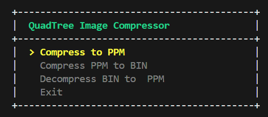
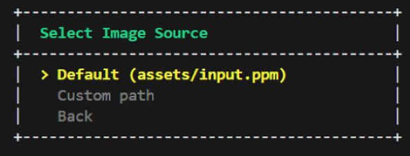

# QuadTree Image Compressor

 
[](https://en.wikipedia.org/wiki/C17_(C_standard_revision))
[](https://www.gnu.org/software/make/)
[](https://opensource.org/licenses/MIT)

> **QuadTree Image Compressor** is a **CLI-based** image compression tool that uses a **QuadTree** spatial decomposition algorithm to compress and reconstruct **PPM images**.  
> It supports lossy compression with configurable **threshold** and **minimum block size**, binary serialization of the tree structure, and full decompression back to a viewable image — all through a fast and efficient console interface.

---

## Features

* **Configurable Compression** — Fine-tune the compression quality via two parameters: a floating-point **threshold** (color variance tolerance per block) and an integer **minimum block size** (smallest subdivision unit in pixels).
* **Compress to PPM** — Load a `.ppm` image, apply QuadTree decomposition with a user-defined threshold and minimum block size, and reconstruct the result as a new compressed `.ppm` output file.
* **Compress to BIN** — Serialize the full QuadTree structure of a compressed image into a compact binary `.bin` file for efficient storage and later retrieval.
* **Decompress BIN to PPM** — Load a previously serialized `.bin` file, reconstruct the QuadTree in memory, and render the image back to a `.ppm` output file.
* **Default & Custom Paths** — Each operation supports both a one-click default path (`assets/input.ppm`, `assets/output.bin`) and a fully custom file path entered at runtime.

---
 
## How It Works
 
Each image is recursively split into four quadrants. When the **color variance** of a block drops below the **threshold** — or the block hits the **minimum size** — it collapses into a single averaged color. This means **high-detail regions** (edges, textures) are preserved with finer subdivisions, while **uniform regions** (sky, backgrounds) are  merged into large single-color blocks. In this example we observe an approximately **11× size reduction**:
 
<table align="center">
  <tr>
    <td align="center" width="50%"><b>Original</b></td>
    <td align="center" width="50%"><b>Compressed</b></td>
  </tr>
  <tr>
    <td align="center"></td>
    <td align="center"></td>
  </tr>
  <tr>
    <td align="center"><sub>2374 KB</sub></td>
    <td align="center"><sub>212 KB</sub></td>
  </tr>
</table>

---

### Navigation

The application uses an arrow-key driven menu. Use the **Up** and **Down** arrow keys to move between options and press **Enter** to confirm a selection.

<p align="center">
  
  
</p>

---

## Repository Structure

```
QuadTree-Image-Compression/
├── assets/
├── include/
│   ├── imageIO.h
│   └── QuadTree.h
├── src/
│   ├── main.c
│   ├── imageIO.c
│   └── QuadTree.c
├── .gitignore
├── Makefile
├── LICENSE
└── README.md
```

---

## Dependencies

| Dependency       | Required Version |
| :--------------- | :--------------- |
| **Compiler**     | GCC `13.2+`       |
| **Build System** | Make  `3.81+`     |

---

## Build Instructions
 
Make sure **GCC** and **Make** are installed on your system before proceeding.
 
Navigate to the project root:
 
```bash
cd QuadTree-Image-Compression
```
 
Compile the project:
 
```bash
make
```
 
Run the application:
 
```bash
./Compress.exe
```
 
To remove compiled object files and the executable:
 
```bash
make clean
```

---

## License

This project is licensed under the MIT License. See the [LICENSE](LICENSE) file for details.